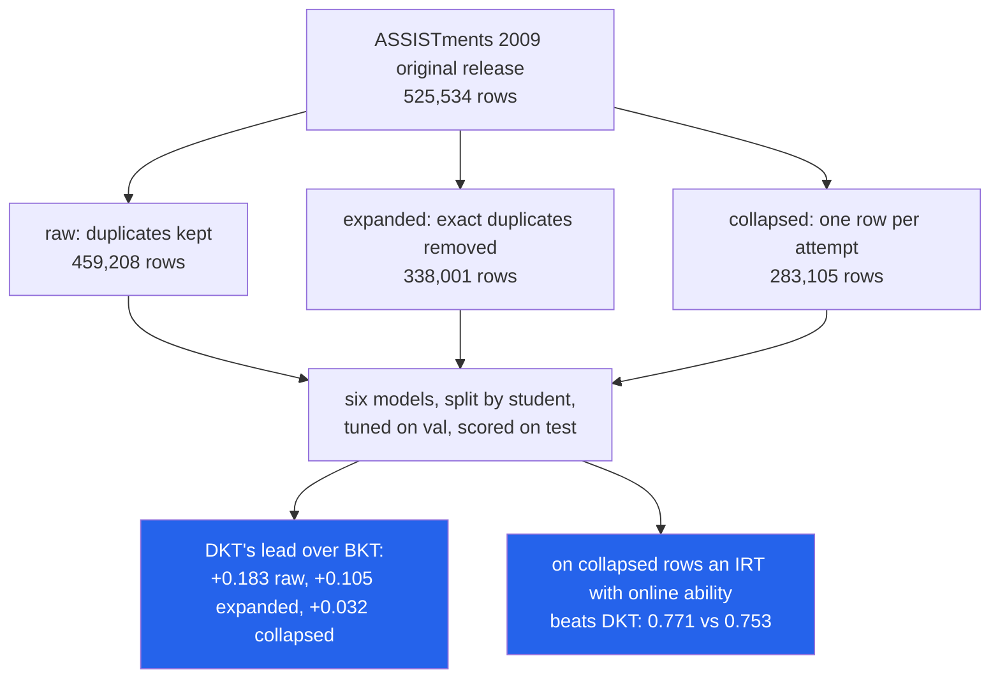

<h1 align="center">knowledge-tracing (BKT · PFA · IRT · DKT · numpy)</h1>
<p align="center"><i>Four student models written from scratch, and a measurement of how much of deep knowledge tracing's famous lead on ASSISTments was duplicated rows</i></p>

<p align="center">
  <a href="#the-through-line">The through-line</a> &middot;
  <a href="#findings">Findings</a> &middot;
  <a href="#input--output">Input / Output</a> &middot;
  <a href="#quick-start">Quick start</a> &middot;
  <a href="#what-this-does-not-do">What it does NOT do</a> &middot;
  <a href="#problems-hit-while-building-this">Problems hit</a>
</p>

<p align="center">
  
  
  
  
  <a href="LICENSE"></a>
</p>

---

Inspired by [HKUDS/DeepTutor](https://github.com/HKUDS/DeepTutor): this rebuilds the
student-modelling core an adaptive tutor needs - *what does this student know, and what
should they do next?* - from scratch. No code from it is used.

## The through-line



The ASSISTments 2009 skill-builder file writes a multi-skill attempt once per skill tag, and
the original release also repeats 121,207 records outright. After sorting by student and time,
**38.3% of rows are copies of the row immediately before them** - same attempt, same answer.
A recurrent model that sees the previous row's answer can copy it; a per-skill model cannot,
because the copy carries a different skill tag.

> **On the file as shipped, DKT scores 0.920 test AUC and beats BKT by 0.183. Score the very
> same trained model once per real attempt and it drops to 0.749. Train and score on one row
> per attempt and it is 0.753 - still ahead of BKT (+0.032) and PFA (+0.044), but *behind* a
> plain 1PL IRT whose ability is re-estimated from each student's own history (0.771).**
> On a second dataset (KDD Cup Algebra 2005) the same pattern holds - duplicated rows add
> +0.10 AUC to DKT - and after collapsing, DKT and IRT tie (0.812 vs 0.808), with DKT's edge
> gone by the time it has to predict two attempts ahead.

## Findings

| # | Question | Answer (test set, split by student, 95% student-level bootstrap CIs) |
|---|---|---|
| 1 | How much do duplicate rows inflate DKT? | ASSIST09: **0.920 → 0.753** (raw → collapsed). The raw-trained model scored once per attempt: **0.749**. Algebra05: **0.912 → 0.812**. |
| 2 | Does DKT's advantage survive de-duplication? | Over BKT/PFA, yes, shrunk ~5x: DKT − BKT **+0.183 → +0.032 [0.021, 0.046]**. Over IRT, no: DKT − IRT-1PL **−0.017 [−0.032, −0.002]** on ASSIST09, **+0.004 [−0.003, 0.012]** on Algebra05. |
| 3 | How much does a row-level random split inflate results? | Much less than duplicates. Letting IRT reuse a student's *fitted* ability (the row-split leak) adds **+0.006 to +0.008** AUC overall on ASSIST09, concentrated in a student's first five attempts (**+0.038** for 1PL, **+0.047** for 2PL); on Algebra05 it adds +0.001 to +0.002. |
| 4 | Next attempt vs later attempts? | IRT barely moves (ASSIST09 0.771 → 0.758 at 10 ahead). DKT loses most of its lead: Algebra05 **0.812 → 0.787** one step further out, below the history-free item baseline (0.791). BKT and PFA fall below that baseline on ASSIST09 by 3 ahead. |
| 5 | Does "predicted 0.7" mean 70% correct? | For IRT-1PL and DKT, yes (observed 0.700 and 0.704 on ASSIST09). BKT over-promises (0.685 observed at 0.711 predicted). |
| 6 | Is model-declared mastery better than three-in-a-row? | At equal coverage (46% of student-skill sequences), later accuracy is **0.800** for DKT, 0.766 for BKT, **0.695** for the three-correct-in-a-row rule. On Algebra05 BKT, PFA, IRT and DKT all land at 0.834-0.837, against the streak rule's 0.819. |
| 7 | Do BKT's guess/slip bounds matter? | Unbounded EM drives **7 of 149** ASSIST09 skills and **54 of 280** Algebra05 skills to guess + slip >= 1 (a correct answer then *lowers* P(known)). The bounds cost 0.005 (ASSIST09) and 0.010 (Algebra05) test AUC. |

Every number above is in [`results/SUMMARY.md`](results/SUMMARY.md), which `kt report`
generates from the JSON files in `results/`.

### 1-2 · The duplicates, measured on the same 208 test students

ASSISTments 2009-2010 skill builder, original release (the one the DKT paper used), 4,163
students, split 80/15/5 by student (3,331 / 624 / 208). Hyper-parameters were chosen on the
collapsed variant's validation students and reused for the other two.

| rows are | rows | copies of previous row | ItemMean | BKT | PFA | IRT-1PL | IRT-2PL | DKT |
|---|---:|---:|---:|---:|---:|---:|---:|---:|
| raw | 459,208 | 38.3% | 0.626 | 0.737 | 0.743 | 0.731 | 0.722 | **0.920** |
| raw, scored once per attempt | 15,053 | - | 0.689 | 0.705 | 0.697 | 0.761 | 0.757 | **0.749** |
| expanded | 338,001 | 16.2% | 0.689 | 0.714 | 0.706 | 0.767 | 0.764 | 0.819 |
| expanded, scored once per attempt | 15,053 | - | 0.696 | 0.713 | 0.705 | 0.767 | 0.763 | 0.752 |
| collapsed | 283,105 | 0.0% | 0.697 | 0.721 | 0.710 | **0.771** | 0.767 | 0.753 |

| paired test AUC difference | raw | expanded | collapsed |
|---|---|---|---|
| DKT − BKT | +0.183 [0.086, 0.251] | +0.105 [0.089, 0.119] | +0.032 [0.021, 0.046] |
| DKT − PFA | +0.177 [0.116, 0.229] | +0.113 [0.099, 0.127] | +0.044 [0.031, 0.057] |
| DKT − IRT-1PL | +0.189 [0.094, 0.261] | +0.053 [0.035, 0.068] | −0.017 [−0.032, −0.002] |

The raw-trained DKT is not a worse model - scored once per attempt it matches the collapsed
one (0.749 vs 0.753). The inflation is entirely in *what gets scored*: 13,372 of the 28,425
raw test rows are answered by the row before them. Our collapse of the original file matches
the publisher's own `skill_builder_data_corrected_collapsed.csv` exactly (283,105 attempts,
same ids, same outcomes - `results/assist09/data.json`, `crosscheck`).

Collapsed, all models, train / val / test:

| model | selected on val | train AUC | val AUC | test AUC | test 95% CI | test RMSE | test ECE |
|---|---|---:|---:|---:|---|---:|---:|
| ItemMean | strength=2 | 0.766 | 0.689 | 0.697 | [0.672, 0.716] | 0.458 | 0.038 |
| BKT | bounds 0.3/0.3 | 0.723 | 0.722 | 0.721 | [0.698, 0.739] | 0.446 | 0.028 |
| PFA | l2=10 | 0.713 | 0.707 | 0.710 | [0.688, 0.728] | 0.455 | 0.032 |
| IRT-1PL | item_sd=1 | 0.812 | 0.776 | **0.771** | [0.749, 0.789] | **0.430** | **0.005** |
| IRT-2PL | item_sd=2 | 0.816 | 0.774 | 0.767 | [0.744, 0.785] | 0.433 | 0.038 |
| DKT | hidden=64, lr=0.003 | 0.757 | 0.752 | 0.753 | [0.737, 0.769] | 0.435 | 0.010 |

Train AUC for ItemMean and IRT is partly in-sample memorisation of item difficulty (17,751
items, many seen by a handful of students), which is why it sits well above val and test.
The ranking holds on two more student splits (seeds 1 and 2): IRT-1PL 0.760 / 0.777, DKT 0.731
/ 0.754, BKT 0.703 / 0.730.

**Algebra 2005 (KDD Cup 2010)**, 574 students (459 / 86 / 29), 607,025 steps with a KC:

| model | train AUC | val AUC | test AUC | test 95% CI |
|---|---:|---:|---:|---|
| ItemMean | 0.890 | 0.788 | 0.790 | [0.776, 0.801] |
| BKT | 0.760 | 0.751 | 0.741 | [0.724, 0.754] |
| PFA | 0.760 | 0.751 | 0.744 | [0.729, 0.755] |
| IRT-1PL | 0.872 | 0.816 | 0.808 | [0.793, 0.819] |
| IRT-2PL | 0.871 | 0.816 | 0.809 | [0.794, 0.820] |
| DKT | 0.836 | 0.820 | **0.812** | [0.800, 0.819] |

Expanded (one row per KC, 31.3% copies): DKT 0.912, and 0.793 when scored once per step.
Twenty-nine test students is few; seeds 1 and 2 give DKT 0.817 / 0.832 and IRT-1PL 0.817 /
0.827 - a tie every time.

### 3 · Leakage from a row-level split is small next to duplicates

A random row split assigns 80% of each student's rows to training. For BKT, PFA and DKT, whose
parameters are shared by all students, that leaks little. For IRT it lets the model fit each
test student's ability on answers they gave *later*. Comparing the two IRT modes on the
**same** row-split test rows isolates that leak:

| ASSIST09, row split | all test rows | first 5 attempts of a student |
|---|---:|---:|
| IRT-1PL, ability re-estimated from history | 0.772 | 0.744 |
| IRT-1PL, ability fitted on the student's train rows (leak) | 0.778 | **0.782** |
| IRT-2PL, re-estimated | 0.767 | 0.719 |
| IRT-2PL, fitted (leak) | 0.775 | **0.766** |

On Algebra05 the same contrast is +0.001 (1PL) and +0.002 (2PL) overall, and on the first five attempts the leaky 1PL is actually slightly worse (0.778 vs 0.782): with 1,000+ steps per student, a few answers already pin the ability down. Row-split and student-split test AUCs for
the population-level models also differ by −0.010 to +0.017, but those are different test rows
from different students, and the seed-to-seed spread of the student split is as large, so they
are not reported as leakage. DKT fitted on a row split scores *lower* (0.743 vs 0.753): it was
trained on sequences with 20% of the rows missing and then asked to read complete ones.

### 4 · Predicting further ahead (same rows for every k)

Only rows with at least ten earlier attempts; k=3 means the two most recent attempts are hidden.

| ASSIST09 (13,267 rows) | k=1 | k=2 | k=3 | k=5 | k=10 |
|---|---:|---:|---:|---:|---:|
| ItemMean | 0.697 | 0.697 | 0.697 | 0.697 | 0.697 |
| BKT | 0.720 | 0.705 | 0.695 | 0.687 | 0.676 |
| PFA | 0.710 | 0.699 | 0.692 | 0.684 | 0.674 |
| IRT-1PL | **0.771** | **0.769** | **0.767** | **0.764** | **0.758** |
| DKT | 0.754 | 0.737 | 0.726 | 0.714 | 0.692 |

| Algebra05 (35,919 rows) | k=1 | k=2 | k=3 | k=5 | k=10 |
|---|---:|---:|---:|---:|---:|
| ItemMean | 0.791 | 0.791 | 0.791 | 0.791 | 0.791 |
| IRT-1PL | 0.808 | **0.808** | **0.808** | **0.807** | **0.807** |
| DKT | **0.812** | 0.787 | 0.772 | 0.754 | 0.736 |

DKT's whole lead on Algebra05 lives in the most recent step - consecutive steps of one problem
are strongly correlated - and it is below the history-free item baseline one step further out.
For a tutor that plans a session ahead, IRT is the model that still knows something.

### 5-6 · The next-exercise policy, evaluated without a simulator

`kt.policy.recommend` serves the skill whose predicted P(correct) is closest to 0.7 (or stops a
skill once it passes a mastery threshold). Replaying a log cannot evaluate a policy whose
choices differ from the log's, so two things that *can* be measured on logged attempts are:

**Does the promise hold?** ASSIST09 test attempts each model predicted in [0.65, 0.75]:

| model | attempts | mean predicted | observed correct | 95% CI |
|---|---:|---:|---:|---|
| BKT | 2,917 | 0.711 | 0.685 | [0.654, 0.711] |
| PFA | 3,341 | 0.698 | 0.727 | [0.693, 0.751] |
| IRT-1PL | 2,407 | 0.702 | **0.700** | [0.678, 0.722] |
| DKT | 2,856 | 0.702 | **0.704** | [0.682, 0.725] |

**Is declared mastery real?** (Leopard-style effort/score, González-Brenes & Huang 2015.)
Each model is thresholded to sign off the same 46.0% of ASSIST09 test (student, skill)
sequences as ASSISTments' own rule - three correct in a row:

| rule | mean attempts before sign-off | attempts after | correct after |
|---|---:|---:|---:|
| three correct in a row | 4.20 | 6,475 | 0.695 |
| BKT (P >= 0.769) | 4.56 | 5,727 | 0.766 |
| IRT-1PL (P >= 0.822) | 3.90 | 7,094 | 0.761 |
| PFA (P >= 0.731) | 4.69 | 5,472 | 0.787 |
| DKT (P >= 0.805) | 4.66 | 5,538 | **0.800** |

Three right in a row is a weak mastery signal: students it signs off are right only 69.5% of
the time on that skill afterwards. Any of the models, at the same coverage, signs off students
who stay right 76-80% of the time, for at most half an attempt more practice (IRT signs off
0.3 attempts *sooner*). On Algebra05 BKT, PFA, IRT and DKT all land at 0.834-0.837 against the
streak rule's 0.819 (no confidence intervals are computed for this comparison).

### 7 · BKT identifiability

| | skills | guess at bound | slip at bound | guess + slip >= 1 | test AUC |
|---|---:|---:|---:|---:|---:|
| ASSIST09, bounded (0.3 / 0.3) | 149 | 47 | 36 | 0 | 0.721 |
| ASSIST09, unbounded | 149 | 1 | 4 | **7** | 0.726 |
| Algebra05, bounded | 280 | 138 | 86 | 0 | 0.741 |
| Algebra05, unbounded | 280 | 22 | 22 | **54** | 0.751 |

Unbounded EM fits better and predicts slightly better, and on 54 Algebra skills it does so by
learning that a student who *knows* the skill is less likely to answer correctly than one who
does not. The bounded model is kept as the default because its P(known) means what a tutor
needs it to mean; the AUC cost is stated rather than hidden.

## Input / Output

**1. The known-answer check** - `uv run python demo.py` (students simulated from BKT parameters
we chose; EM must recover them):

```
== 1. EM recovers BKT parameters it did not see
   60,000 simulated attempts, 3 skills, EM stopped after 11 iterations
   param  skill   true  fitted
   prior      0   0.10   0.103
   prior      1   0.50   0.519
   learn      0   0.30   0.293
   learn      1   0.05   0.046
   guess      1   0.25   0.252
   slip       2   0.08   0.082
   ...
   largest error: 0.019

== 2. No model reads the answer it is predicting
   BKT: max change at t after flipping answers t.. : 0.0e+00
   PFA: max change at t after flipping answers t.. : 0.0e+00
```

**2. Picking the next exercise** - `uv run kt recommend --history examples/history.csv`
(BKT fitted on ASSIST09, committed in `models/`):

```
history: 14 attempts over 4 skills
P(correct)  skill
     0.611  296:Area Rectangle
     0.661  1:Box and Whisker
     0.696  310:Order of Operations All  <- next
     0.803  11:Venn Diagram

next exercise: 310:Order of Operations All (predicted P(correct) 0.70 is closest to target 0.70)
```

Three wrong answers leave *Area Rectangle* at 0.611 rather than near the floor: its fitted
prior is 0.897 and its learn rate 0.428, so BKT assumes a student who got it wrong has probably
just learnt it. That is the model's opinion, faithfully reported - and a reason finding 5
checks what the numbers mean before a tutor acts on them.

**3. What is in the data** - `uv run kt inspect --data data/raw/skill_builder_data_original.csv --variant raw`:

```
{
  "variant": "raw",
  "rows": 459208,
  "attempts": 283105,
  "rows_per_attempt": 1.6220412921001042,
  "students": 4163,
  "skills": 123,
  "correct_rate": 0.6903734255500775,
  "cleaning": {
    "raw_rows": 525534,
    "missing_skill_rows": 66326,
    "exact_duplicate_rows": 121207,
    "multi_skill_attempts": 47037,
    ...
  },
  "adjacent_copies": {"rows": 459208, "repeat_rows": 176103, "repeat_share": 0.3834928833992439}
}
```

Duplicated rows are not a random sample: the correct rate is 0.690 with them and 0.658 without.

**4. A bad input** - a skill the model does not know, and a non-binary answer:

```
$ uv run kt recommend --history h.csv          # h.csv names "Circle Graph"
error: unknown skill 'Circle Graph'; 5 names contain it. Run `kt skills` to list them.
$ uv run kt recommend --history bad.csv        # correct column says "yes"
error: ...ad.csv line 2: correct must be 0 or 1, got 'yes'
```

**5. The model arm, planned but not run** - `scripts/run_models.sh --dry-run`:

```
== job list
  1. kt llm run    model=qwen2.5:14b-instruct host=http://127.0.0.1:11434 jobs=300
  2. kt llm score  -> results/assist09/llm_arm.json
  model qwen2.5:14b-instruct at http://127.0.0.1:11434
  jobs: 300  cached: 0  model calls needed: 300
  estimate: 300 calls x ~3 s (14B model, one consumer GPU) = ~15 min
(dry run: no model was called)
```

## The LLM arm (built, queued, not run)

Can an instruction-tuned LLM read an answer history as text and predict the next answer?
`kt llm build` froze 300 ASSIST09 test attempts (from 172 students, at most two per student,
each with at least five earlier attempts) into `results/assist09/llm_jobs.jsonl`, together
with every classical model's prediction for exactly those rows. Each prompt lists the last 30
attempts as `skill: correct/incorrect` and asks for `{"p_correct": x}`. Unparseable replies
are scored as a base-rate guess and counted, never dropped. Every generation is cached on disk
by (model, prompt hash, options). `scripts/run_models.sh` checks free RAM and GPU memory
before it starts. No LLM number appears in this README because none has been produced.

## Quick start

```bash
git clone https://github.com/hammasbuilds/knowledge-tracing
cd knowledge-tracing
uv sync
uv run pytest -q                 # 71 tests, no data or network needed
uv run python demo.py            # known-answer checks + one real recommendation

scripts/fetch_data.sh            # ASSISTments 2009 (+ official collapsed file) and Algebra 2005, sha256-checked
uv run kt study --data data/raw/skill_builder_data_original.csv \
                --crosscheck data/raw/skill_builder_data_corrected_collapsed.csv   # ~31 min, CPU
uv run kt study --dataset algebra05 --data data/raw/algebra_2005_2006.zip \
                --variant expanded --variant collapsed                              # ~73 min, CPU
uv run kt report                 # results/SUMMARY.md
```

## Layout

```
src/kt/
  data.py         ASSISTments 2009 and KDD Cup 2010 loaders; raw / expanded / collapsed variants
  splits.py       split by student (80/15/5) and the leaky split by row
  seq.py          "what is visible at horizon k" index arithmetic shared by every model
  models/
    baseline.py   ItemMean: smoothed item -> skill -> global correct rate, no history
    bkt.py        BKT per skill, EM with exact constrained M-step and pooled fallback
    pfa.py        PFA, one Newton-fitted logistic regression per skill
    irt.py        1PL / 2PL with item offsets shrunk to skill difficulty; online EAP ability
    dkt.py        DKT: numpy LSTM with a hand-written, gradient-checked backward pass
  metrics.py      AUC (ties averaged), RMSE, log loss, ECE, student-level cluster bootstrap
  policy.py       next-exercise recommendation, band check, Leopard effort/score
  study.py        the experiments; run.py writes them to results/<dataset>/
  llm.py          prompts, cached Ollama client, sampling, scoring (the model arm)
  report.py       results/*.json -> results/SUMMARY.md
  cli.py          kt study | inspect | recommend | skills | report | llm build/run/score
models/           fitted BKT (json) and DKT (npz) for both datasets
results/          every number in this README
scripts/          fetch_data.sh, run_models.sh
examples/         the history used in Input / Output
```

## Requirements

Python 3.11+, `uv`, and numpy - the only runtime dependency. No GPU; the whole study is
single-threaded numpy (see Problems hit for why single-threaded). Loading Algebra05, the larger
dataset, peaked at about 500 MB.

## Tests

```bash
uv run pytest -q    # 71 tests, ~20 s
uv run ruff check
```

The ones that carry weight:

- **No model reads the answer it predicts**, for every model at horizons 1 and 3: flipping
  every outcome at positions > t − k must leave the prediction at t unchanged. This test found
  a real cross-student leak (Problems hit, 3).
- The LSTM backward pass matches finite differences to 1e-5 relative error.
- EM recovers generating BKT parameters within 0.05; BKT predictions match a straight-line
  reference filter; the k-ahead prediction matches a hand-derived marginalisation.
- AUC matches the pairwise definition with ties; the bootstrap CI excludes zero for a real
  difference and includes 0.5 for noise.
- The whole study runs end to end on a synthetic ASSISTments-format file, including the report,
  the saved-prediction reload and the LLM job builder (with a fake client).

Tests use fixtures and fakes only: no network, no dataset, no model.

## What this does NOT do

- **It does not run the LLM.** The arm is built and tested with a fake client; its result is
  queued, not reported.
- **DKT here reads skills, not items**, as in the original paper. IRT uses item identity, which
  is part of why it wins on ASSIST09; a DKT with item embeddings might close that gap and was
  not tried.
- **It does not evaluate the policy causally.** The band check and the mastery comparison say
  whether a model's numbers mean what the policy assumes; they do not say whether students
  taught by the policy would learn more. That needs a trial or a simulator, and a simulator
  built from one of these models would grade itself.
- **The post-sign-off accuracy is observational.** ASSISTments ends an assignment at three
  correct in a row, so the attempts "after" a sign-off come from later practice of the skill,
  which not every student does.
- **Algebra05's test split is 29 students.** The CIs are honest about it, and the ranking was
  checked on two more splits, but it is a small test set.
- **It does not handle forgetting.** BKT has no forget parameter and no model uses time gaps.

## Problems hit while building this

1. **Both download hosts crawl.** The USTC mirror gave ~1.5 KB/s per connection and Google
   Drive ~15 KB/s. Files are fetched as 32 parallel byte ranges. The first stitched Algebra zip
   was 13.7 MB of 22.4 MB - some ranges had given up after eight retries - and `cat` joined
   what it had without complaint. `fetch_data.sh` now refuses any file whose sha256 does not
   match.
2. **The Algebra zip contains `__MACOSX/._algebra_2005_2006_train.txt`**, a macOS resource fork
   with the same suffix as the real file. The loader picks members by suffix, so it now skips
   `__MACOSX/` and `._*` explicitly.
3. **A k-ahead index leaked across students.** `observed_in_seq` finds how much of a (student,
   skill) sequence is visible with `searchsorted(keys, seq * big + (pos − k))`. When
   `pos − k < 0` that key falls inside the *previous* sequence - another student or skill - so
   BKT and PFA at k=3 read someone else's history. The flip test caught it on the first run; the
   count is now clamped at 0.
4. **BKT's backward pass overflowed on the raw ASSISTments file.** Long runs of duplicated
   correct answers drive P(known) to ~1, and the classic scaled backward variable is bounded
   only by 1/P(state), so the other state's value blew up to inf, then NaN. The backward
   variables are now renormalised every step and the transition posteriors are normalised
   directly, so the scale cancels.
5. **EM hit its 100-iteration cap on ASSIST09 without converging.** The cap is now 500 and
   every fit records whether it converged (it does, in 103 iterations).
6. **The official collapsed file writes missing skills as `NA` and joint skills as `1_13`**,
   which broke an `int()` sort. Both are handled, and the collapse of the original file is
   checked against it row for row.
7. **Multi-threaded BLAS made DKT eight times slower.** One LSTM chunk at hidden size 128 took
   1.28 s with numpy's default thread pool and 0.15 s single-threaded, on a machine where other
   jobs were using the cores. `kt` sets `OMP_NUM_THREADS=1` (and friends) unless the caller has
   set them; the ASSIST09 study went from an estimated 3+ hours to 31 minutes. `np.add.at`,
   the other hot spot, was replaced with a sorted `reduceat`.

## Keywords

knowledge tracing &middot; Bayesian knowledge tracing &middot; BKT &middot; deep knowledge
tracing &middot; DKT &middot; performance factors analysis &middot; item response theory &middot;
IRT &middot; student modelling &middot; adaptive learning &middot; intelligent tutoring systems
&middot; educational data mining &middot; ASSISTments &middot; KDD Cup 2010 &middot; data
leakage &middot; duplicate rows &middot; mastery learning &middot; LSTM from scratch &middot;
expectation maximisation

## License

MIT
